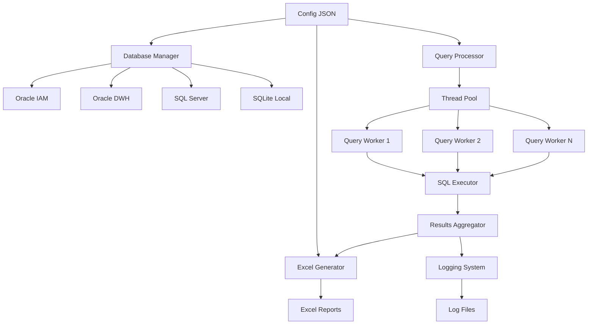

# 🔄 COMPLEX - Sistema Avanzato di Trasferimento Dati Multi-Database


**TIM S.p.A. - Sicurezza Cyber & Digital Operations**  
*Divisione SEC.CS.CDO*

---

**Versione:** 2.0  
**Autore:** Daniele Speziale  
**Manager:** Cinzia Pontoni  
**Data Creazione:** 25/09/2025  
**Ultimo Aggiornamento:** 30/09/2025

---


## 📋 Indice

1. [🎯 Panoramica del Progetto](#-panoramica-del-progetto)
2. [🏗️ Architettura del Sistema](#️-architettura-del-sistema)
3. [🗂️ Struttura del Progetto](#️-struttura-del-progetto)
4. [⚙️ Componenti Core](#️-componenti-core)
5. [🔧 Configurazione](#-configurazione)
6. [📊 Sistema di Query](#-sistema-di-query)
7. [📈 Generazione Report Excel](#-generazione-report-excel)
8. [🚀 Installazione e Setup](#-installazione-e-setup)
9. [💻 Utilizzo](#-utilizzo)
10. [🔍 Monitoring e Logging](#-monitoring-e-logging)
11. [🛠️ Troubleshooting](#️-troubleshooting)
12. [📖 API Reference](#-api-reference)
13. [🔐 Sicurezza](#-sicurezza)
14. [📝 Note Legali](#-note-legali)

---

## 🎯 Panoramica del Progetto

**Complex** è un sistema enterprise-grade sviluppato da TIM S.p.A. per automatizzare il trasferimento e la sincronizzazione di dati tra database eterogenei. Il sistema supporta operazioni complesse di ETL (Extract, Transform, Load) con capacità avanzate di elaborazione multitasking e generazione automatica di report analitici.

### ✨ Caratteristiche Principali

- 🔄 **Multi-Database Support**: Oracle, SQL Server, SQLite
- 🧵 **Elaborazione Multitasking**: Esecuzione parallela fino a 8 worker threads
- 📊 **Report Excel Avanzati**: Generazione automatica con formattazione professionale
- 🔧 **Query Flessibili**: Supporto per file SQL esterni, template e query multiriga
- 📝 **Logging Avanzato**: Sistema di log strutturato con cleanup automatico
- 🛡️ **Sicurezza Enterprise**: Autenticazione Windows e credential management
- 🎛️ **Configurazione JSON**: Setup centralizzato e modificabile a runtime

### 🏢 Contesto Aziendale

Il progetto è sviluppato per supportare le operazioni di Identity & Access Management (IAM) e Data Warehouse (DWH) dell'infrastruttura TIM, garantendo sincronizzazione e monitoraggio dei sistemi di sicurezza informatica.

---

## 🏗️ Architettura del Sistema



### 🔧 Componenti Architetturali

| Componente | Descrizione | Responsabilità |
|------------|-------------|----------------|
| **Database Manager** | Gestore connessioni multi-database | Connection pooling, autenticazione, schema management |
| **Query Processor** | Engine di elaborazione query multitasking | Esecuzione parallela, gestione errori, ottimizzazione |
| **Excel Generator** | Generatore report Excel multi-foglio | Formattazione, styling, proprietà documento |
| **Config Manager** | Gestore configurazione centralizzata | Validazione, caricamento, gestione parametri |
| **Logging System** | Sistema di logging strutturato | Audit trail, debugging, monitoraggio performance |

---

## 🗂️ Struttura del Progetto

```
Complex/
├── 📁 Core/                          # Componenti principali
│   ├── 🐍 __init__.py               # Inizializzazione package
│   ├── 🗄️ database_manager.py       # Gestore database multi-source
│   ├── ⚡ enhanced_multi_query_processor.py  # Processore multitasking
│   └── 📊 excel_report_generator.py  # Generatore report Excel
│
├── 📁 Queries/                       # Query SQL standard
│   ├── 🔍 DWH-DB-NOSTD.sql         # Query DB non-standard DWH
│   ├── 🔍 DWH-DB-STD.sql           # Query DB standard DWH
│   ├── 🔍 DWH-IA-NONSTD.sql        # Query IA non-standard DWH
│   ├── 🔍 DWH-IA-STD.sql           # Query IA standard DWH
│   ├── 🔍 DWH-SO-NOSTD.sql         # Query SO non-standard DWH
│   ├── 🔍 DWH-SO-STD.sql           # Query SO standard DWH
│   ├── 🔍 IAM-PM-DB.sql            # Query perimetro DB IAM
│   ├── 🔍 IAM-PM-IA.sql            # Query perimetro IA IAM
│   └── 🔍 IAM-PM-SO.sql            # Query perimetro SO IAM
│
├── 📁 Reports/                       # Sistema di reporting
│   └── 📁 Queries/                  # Query specifiche per report
│       ├── 📈 RPT-DB_NOSTD_DWH.sql # Report DB non-standard
│       ├── 📈 RPT-DB_NOSTD_IAM.sql
│       ├── 📈 RPT-DB_STD_DWH.sql   # Report DB standard
│       ├── 📈 RPT-DB_STD_IAM.sql
│       ├── 📈 RPT-IA_NOSTD_DWH.sql # Report IA non-standard
│       ├── 📈 RPT-IA_NOSTD_IAM.sql
│       ├── 📈 RPT-IA_STD_DWH.sql   # Report IA standard
│       ├── 📈 RPT-IA_STD_IAM.sql
│       ├── 📈 RPT-SO_NOSTD_DWH.sql # Report SO non-standard
│       ├── 📈 RPT-SO_NOSTD_IAM.sql
│       ├── 📈 RPT-SO_STD_DWH.sql   # Report SO standard
│       └── 📈 RPT-SO_STD_IAM.sql
│
├── ⚙️ config.json                   # Configurazione sistema
├── 🚀 app.py                        # Applicazione principale
└── 📊 generate_excel_reports.py     # Script generazione report
```

---

## ⚙️ Componenti Core

### 🗄️ Database Manager (`database_manager.py`)

Il **Database Manager** è il cuore del sistema di connettività, responsabile della gestione delle connessioni a database eterogenei.

#### 🔧 Funzionalità Principali

- **Multi-Database Support**: Oracle, SQL Server, SQLite
- **Connection Pooling**: Gestione efficiente delle connessioni
- **Authentication**: Windows Authentication e credential-based
- **Schema Management**: Creazione automatica schemi
- **Error Handling**: Gestione robusta degli errori di connessione

#### 📋 Metodi Chiave

```python
class DatabaseManager:
    def get_connection(self, db_name: str)           # Connessione generica
    def get_oracle_connection(self, db_name: str)    # Connessione Oracle specifica
    def get_mssql_connection(self, db_name: str)     # Connessione SQL Server
    def test_connection(self, db_name: str) -> bool  # Test connettività
    def create_schema_if_not_exists(self, db_name: str, schema: str)
```

### ⚡ Enhanced Multi Query Processor (`enhanced_multi_query_processor.py`)

Il **Query Processor** implementa un sistema di elaborazione multitasking avanzato per l'esecuzione parallela di query complesse.

#### 🧵 Caratteristiche Multitasking

- **Thread Pool Executor**: Fino a 8 worker threads configurabili
- **Concurrent Query Limit**: Controllo del carico simultaneo
- **Query Timeout**: Timeout configurabile per query lunghe
- **Thread Safety**: Logging e progress tracking thread-safe
- **Error Isolation**: Fallimento di una query non blocca le altre

#### 📝 Supporto Query Avanzate

| Tipo Query | Descrizione | Esempio |
|------------|-------------|---------|
| **Inline String** | SQL diretto in configurazione | `"SELECT * FROM users"` |
| **Array Multiriga** | Query su più righe per leggibilità | `["SELECT id,", "name FROM", "users"]` |
| **File Esterni** | Query caricate da file `.sql` | `"sql_file": "query.sql"` |
| **Template Parametrici** | Template con sostituzione parametri | `"SELECT * FROM {table_name}"` |

#### 🎯 Metriche Performance

- **Execution Time Tracking**: Tempo di esecuzione per query
- **Row Count Monitoring**: Conteggio righe elaborate
- **Speedup Calculation**: Fattore di accelerazione multitasking
- **Resource Utilization**: Utilizzo threads e memoria

### 📊 Excel Report Generator (`excel_report_generator.py`)

Il **Excel Generator** produce report professionali multi-foglio con formattazione avanzata.

#### 🎨 Funzionalità di Formattazione

- **Professional Styling**: Colori corporate TIM, font ottimizzati
- **Auto-Sizing**: Ridimensionamento automatico colonne
- **Header Formatting**: Intestazioni in grassetto con sfondo colorato
- **Freeze Panes**: Blocco prima riga per navigazione
- **Document Properties**: Metadata completi (autore, titolo, keywords)

#### 📋 Struttura Report

```json
{
  "name": "Report_Name",
  "properties": {
    "title": "Titolo Professionale",
    "author": "Daniele Speziale",
    "company": "TIM SPA - SEC.CS.CDO",
    "manager": "Cinzia Pontoni"
  },
  "sheets": [
    {
      "name": "Foglio1",
      "database": "source_db",
      "sql_file": "query.sql",
      "description": "Descrizione contenuto"
    }
  ]
}
```

---

## 🔧 Configurazione

### ⚙️ Struttura config.json

Il file `config.json` centralizza tutta la configurazione del sistema:

```json
{
  "databases": {
    "oracle_iam": {
      "type": "oracle",
      "host": "10.22.112.70",
      "port": 1551,
      "service_name": "iam.griffon.local",
      "auth_type": "windows",
      "username": "X1090405",
      "password": "***"
    },
    "mssql_sviluppo_dest": {
      "type": "mssql",
      "server": "GRFWWW010VEN01.griffon.local",
      "port": 1433,
      "database": "SVILUPPO",
      "auth_type": "windows",
      "driver": "ODBC Driver 17 for SQL Server",
      "default_schema": "Test"
    }
  },
  "queries": [...],
  "excel_reports": [...],
  "execution": {
    "batch_size": 1000,
    "timeout_seconds": 300,
    "max_workers": 8,
    "max_concurrent_queries": 6,
    "enable_multitasking": true,
    "log_level": "INFO"
  }
}
```

### 🗄️ Configurazione Database

#### Oracle Database
```json
{
  "type": "oracle",
  "host": "hostname",
  "port": 1521,
  "service_name": "service",
  "auth_type": "windows|credentials",
  "username": "user",
  "password": "pass"
}
```

#### SQL Server
```json
{
  "type": "mssql",
  "server": "server.domain.local",
  "port": 1433,
  "database": "database_name",
  "auth_type": "windows|sql",
  "driver": "ODBC Driver 17 for SQL Server",
  "default_schema": "dbo"
}
```

### 📝 Configurazione Query

#### Query Standard
```json
{
  "name": "Query Description",
  "source_database": "source_db",
  "destination_database": "dest_db",
  "sql_file": "query.sql",
  "destination_table": "output_table",
  "destination_schema": "schema_name",
  "enabled": true
}
```

#### Query con Template
```json
{
  "name": "Parametric Query",
  "sql_template": "template.sql",
  "template_params": {
    "table_name": "users",
    "date_filter": "2025-01-01"
  }
}
```

### 🎛️ Parametri Execution

| Parametro | Descrizione | Default | Range |
|-----------|-------------|---------|-------|
| `batch_size` | Dimensione batch per inserimenti | 1000 | 100-5000 |
| `max_workers` | Thread worker massimi | 4 | 1-16 |
| `max_concurrent_queries` | Query simultanee | 3 | 1-10 |
| `query_timeout_seconds` | Timeout query | 300 | 30-3600 |
| `log_cleanup_days` | Giorni retention log | 3 | 1-30 |

---

## 📊 Sistema di Query

### 🔍 Tipi di Query Supportate

#### 1. **Query Standard DWH**
Estrazione dati dal Data Warehouse per analisi:

```sql
-- DWH-IA-STD.sql - Login Standard Interfaccia Applicativa
SELECT DISTINCT APPLICAZIONE, COUNT(*) as LOGIN_COUNT
FROM IAM_DWH.ACCOUNTS_MONITORAGGIO
WHERE LAYER='INTERFACCIA APPLICATIVA'
  AND TIPO_ACCOUNT IN ('STANDARD')
  AND APPLICAZIONE NOT IN ('HYDRA AAGG','PDLFREE','DEALERID','VTAM','GEMATRON')
GROUP BY APPLICAZIONE
ORDER BY APPLICAZIONE
```

#### 2. **Query Perimetro IAM**
Interrogazione sistemi in perimetro IAM:

```sql
-- IAM-PM-IA.sql - Perimetro Interfaccia Applicativa
SELECT SISTEMA, DESCRIZIONE_SISTEMA, ATTIVO, AMBIENTE,
       DATA_PRESA_IN_CARICO, GRUPPO_COMPETENTE,
       NUMERO_EFFETTIVO_ACCOUNT, TOTALE_ACCOUNT_ATTIVI
FROM REPORT_SERVICE.dbo.APPL_SISTEMA_PERIMETRO
WHERE SISTEMA NOT IN ('HYDRA AAGG','PDLFREE','DealerID','GEMATRON')
  AND DATA_PRESA_IN_CARICO IS NOT NULL
  AND YEAR(DATA_PRESA_IN_CARICO) > '2000'
  AND ATTIVO='Si'
  AND AMBIENTE='ESERCIZIO'
ORDER BY SISTEMA
```

#### 3. **Query Report Comparative**
Confronto dati tra DWH e IAM:

```sql
-- RPT-IA_STD_DWH.sql - Report Comparativo
SELECT DWH.APPLICAZIONE,
    CASE
        WHEN IAM.SISTEMA IS NOT NULL THEN 'PRESENTE SU IAM'
        ELSE 'NON PRESENTE'
    END AS STATO
FROM [SVILUPPO].[DWH].[IA_STD] AS DWH
LEFT JOIN [SVILUPPO].[IAM].[IA_Perimetro] AS IAM 
    ON DWH.APPLICAZIONE = IAM.SISTEMA
ORDER BY DWH.APPLICAZIONE
```

### 🎯 Categorie di Analisi

| Categoria | Codice | Descrizione |
|-----------|--------|-------------|
| **IA** | Interfaccia Applicativa | Login applicazioni business |
| **SO** | Sistema Operativo | Account di sistema operativo |
| **DB** | Database | Utenze database |
| **STD** | Standard | Account utente standard |
| **NOSTD** | Non-Standard | Account sistema/servizio |

### 📈 Metriche Estratte

- **NUMERO_EFFETTIVO_ACCOUNT**: Account realmente attivi
- **TOTALE_ACCOUNT_ATTIVI**: Account abilitati
- **CONSISTENZA**: Stato di allineamento dati
- **DATA_ULTIMO_EXPORT**: Ultimo aggiornamento
- **CONTROLLO_CONSISTENZA**: Flag controllo qualità

---

## 📈 Generazione Report Excel

### 📊 Report Configurati

Il sistema genera automaticamente 6 report Excel multi-foglio:

#### 1. **IA_STD** - Login Standard Interfaccia Applicativa
- **Foglio DWH**: Sistemi intercettati dal DWH
- **Foglio IAM**: Sistemi presenti su IAM
- **Analisi**: Confronto presenza/assenza tra piattaforme

#### 2. **IA_NOSTD** - Login Non-Standard Interfaccia Applicativa
- **Scopo**: Account sistema e M2M per applicazioni
- **Metriche**: Conteggio per applicazione

#### 3. **DB_STD** - Login Standard Database
- **Coverage**: Utenze standard database
- **Include**: Account `STANDARD` e `STANDARD OPS$`

#### 4. **DB_NOSTD** - Login Non-Standard Database
- **Target**: Account sistema database
- **Tipi**: `SISTEMA` e `M2M`

#### 5. **SO_STD** - Login Standard Sistema Operativo
- **Perimetro**: Account utente sistema operativo
- **Esclusioni**: Account tecnici e di servizio

#### 6. **SO_NOSTD** - Login Non-Standard Sistema Operativo
- **Focus**: Account sistema operativo non standard
- **Correlazione**: Mapping con perimetro IAM

### 🎨 Formattazione Report

```python
# Stile Header
header_style = {
    'font': Font(bold=True, color="FFFFFF"),
    'fill': PatternFill(start_color="366092", end_color="366092", fill_type="solid"),
    'alignment': Alignment(horizontal="center")
}

# Auto-sizing colonne
for column in worksheet.columns:
    max_length = max(len(str(cell.value or "")) for cell in column)
    adjusted_width = min(max_length + 2, 50)
    worksheet.column_dimensions[column[0].column_letter].width = adjusted_width
```

### 📋 Proprietà Documento

Ogni report Excel include metadata completi:

```python
wb.properties.title = "Report IA_STD - Analisi Login Standard"
wb.properties.creator = "Daniele Speziale"
wb.properties.company = "TIM SPA - SEC.CS.CDO"
wb.properties.manager = "Cinzia Pontoni"
wb.properties.subject = "Confronto sistemi DWH e IAM"
wb.properties.keywords = "IA, login standard, DWH, IAM, interfaccia applicativa"
```

---

## 🚀 Installazione e Setup

### 📋 Prerequisiti

#### Sistema Operativo
- **Windows**: 10/11, Server 2016+
- **Linux**: Ubuntu 20.04+, RHEL 8+
- **Python**: 3.8+ (Raccomandato: 3.11+)

#### Database Drivers
```bash
# Oracle Instant Client
# Scaricare da Oracle OTN e configurare PATH

# SQL Server ODBC Driver
# Windows: Installer Microsoft
# Linux: mssql-tools package
```

#### Python Dependencies
```bash
pip install pandas>=2.0.0
pip install oracledb>=1.3.0
pip install pyodbc>=4.0.0
pip install openpyxl>=3.1.0
pip install pathlib
```

### 🔧 Installazione Step-by-Step

#### 1. **Clone Repository**
```bash
git clone https://internal-repo/complex-db-transfer.git
cd complex-db-transfer
```

#### 2. **Virtual Environment**
```bash
python -m venv venv
# Windows
venv\Scripts\activate
# Linux/Mac
source venv/bin/activate
```

#### 3. **Install Dependencies**
```bash
pip install -r requirements.txt
```

#### 4. **Configurazione Database**
```bash
# Copia template configurazione
cp config.template.json config.json

# Modifica configurazione
nano config.json
```

#### 5. **Test Setup**
```bash
python app.py --test-connections
```

### 🗂️ Struttura Directory

Il sistema crea automaticamente le directory necessarie:

```
Project/
├── Complex/               # Codice sorgente
├── logs/                 # File di log
├── queries/              # Query SQL standard
├── reports/              # Output report Excel
│   └── queries/         # Query specifiche report
├── config.json          # Configurazione
└── requirements.txt     # Dipendenze Python
```

---

## 💻 Utilizzo

### 🚀 Avvio Applicazione Principale

```bash
# Esecuzione completa pipeline
python app.py

# Test connessioni database
python app.py --test-only

# Modalità debug con log dettagliati
python app.py --debug
```

### 📊 Generazione Report Excel

```bash
# Genera tutti i report configurati
python generate_excel_reports.py

# Report specifico
python generate_excel_reports.py --report IA_STD

# Output personalizzato
python generate_excel_reports.py --output-dir custom_reports/
```

### ⚙️ Configurazione Runtime

#### Modifica Parametri Execution
```json
{
  "execution": {
    "max_workers": 8,           // Aumenta per più parallelismo
    "batch_size": 2000,         // Batch più grandi per performance
    "query_timeout_seconds": 600, // Timeout più lungo per query complesse
    "log_level": "DEBUG"        // Debug dettagliato
  }
}
```

#### Abilitazione/Disabilitazione Query
```json
{
  "queries": [
    {
      "name": "Query Name",
      "enabled": false,         // Disabilita temporaneamente
      // ... resto configurazione
    }
  ]
}
```

### 🔍 Monitoring Execution

#### Output Console
```
INIT: Configurazione caricata (4 database, 9 query)
TEST: Verifica connessioni...
   [oracle_iam] (oracle)... OK
   [oracle_dwh] (oracle)... OK
   [mssql_sviluppo_dest] (mssql)... OK

AVVIO: Trasferimento dati enhanced (9 query)...
THREAD-1: AVVIO Query Login Standard DWH (standard) da [oracle_dwh]
THREAD-2: AVVIO Query Login NON Standard DWH (standard) da [oracle_dwh]
THREAD-1: OK Query Login Standard DWH completata: 1,247 righe

COMPLETATO: Processo enhanced completato!
```

#### Metriche Performance
- **Pipeline Time**: Tempo totale esecuzione
- **Cumulative Query Time**: Tempo somma query individuali
- **Speedup Factor**: Accelerazione multitasking
- **Rows Processed**: Righe totali elaborate
- **Tables Created**: Tabelle create con successo

---

## 🔍 Monitoring e Logging

### 📝 Sistema di Logging

#### Configurazione Log Level
```json
{
  "execution": {
    "log_level": "INFO",      // ERROR, WARNING, INFO, DEBUG
    "log_directory": "logs",
    "log_cleanup_days": 3,
    "enable_auto_cleanup": true
  }
}
```

#### Formato Log Entry
```
2025-09-30 14:30:15,123 - Core.database_manager - INFO - CONNESSIONE Oracle [oracle_iam]: 10.22.112.70:1551
2025-09-30 14:30:15,456 - Core.enhanced_multi_query_processor - INFO - THREAD-1: AVVIO Query Login Standard DWH
2025-09-30 14:30:18,789 - Core.enhanced_multi_query_processor - INFO - THREAD-1: OK Query completata: 1,247 righe in 3.33s
```

#### Categorie Log
| Categoria | Descrizione | Esempi |
|-----------|-------------|---------|
| **INIT** | Inizializzazione sistema | Config loading, directory setup |
| **CONNESSIONE** | Eventi connettività database | Connect, disconnect, errors |
| **THREAD-N** | Attività thread worker | Query start, progress, completion |
| **SCHEMA** | Operazioni schema database | Create schema, table operations |
| **EXCEL** | Generazione report Excel | Sheet creation, formatting, save |

### 📊 Metriche di Performance

#### Query Execution Metrics
```python
{
    'query_name': 'Login Standard DWH',
    'rows': 1247,
    'execution_time': 3.33,
    'source': 'oracle_dwh',
    'destination': 'mssql_sviluppo_dest',
    'table': 'DWH.IA_STD',
    'thread_id': 1
}
```

#### Pipeline Metrics
```python
{
    'stats': {
        'standard_queries': 9,
        'report_queries': 0,
        'total_rows_processed': 15420,
        'total_execution_time': 45.67,
        'total_pipeline_time': 12.34,
        'concurrent_executions': 9,
        'speedup_factor': 3.7
    }
}
```

### 🧹 Log Cleanup Automatico

Il sistema implementa pulizia automatica dei log:

```python
def cleanup_old_logs(log_directory: str, max_age_days: int = 3):
    cutoff_date = datetime.now() - timedelta(days=max_age_days)
    # Elimina file *.log più vecchi di max_age_days
```

---

## 🛠️ Troubleshooting

### ❌ Errori Comuni

#### 1. **Errore Connessione Oracle**
```
ERRORE: connessione Oracle [oracle_iam]: ORA-12514: TNS:listener does not currently know of service requested
```

**Soluzione:**
- Verificare `service_name` in configurazione
- Controllare raggiungibilità host:port
- Validare credenziali utente

#### 2. **Errore SQL Server ODBC**
```
ERRORE: connessione SQL Server [mssql_dest]: [Microsoft][ODBC Driver 17 for SQL Server][SQL Server]Login failed
```

**Soluzione:**
- Verificare autenticazione Windows abilitata
- Controllare permessi utente su database
- Validare driver ODBC installato

#### 3. **Timeout Query**
```
THREAD-2: ERRORE Query [Query Name]: Query timeout dopo 300 secondi
```

**Soluzione:**
```json
{
  "execution": {
    "query_timeout_seconds": 600,  // Aumenta timeout
    "batch_size": 500              // Riduci batch size
  }
}
```

#### 4. **Memoria Insufficiente**
```
MemoryError: Unable to allocate array for 1000000 rows
```

**Soluzione:**
```json
{
  "execution": {
    "batch_size": 100,             // Batch più piccoli
    "max_concurrent_queries": 2    // Meno query parallele
  }
}
```

### 🔧 Debug Avanzato

#### Abilita Debug Logging
```json
{
  "execution": {
    "log_level": "DEBUG"
  }
}
```

#### Test Singola Query
```python
# Disabilita tutte le query tranne una per isolamento errore
{
  "queries": [
    {"name": "Query Test", "enabled": true},
    {"name": "Altre Query", "enabled": false}
  ]
}
```

#### Verifica Database Schema
```python
# Usa metodo get_table_info per verifica post-esecuzione
processor.get_table_info("mssql_sviluppo_dest", "DWH.IA_STD")
```

### 📋 Checklist Diagnostica

- [ ] **Connettività Database**: Test connessioni individuali
- [ ] **Credenziali**: Validazione autenticazione
- [ ] **Permessi**: Lettura source, scrittura destination
- [ ] **Schema Target**: Esistenza e permessi scrittura
- [ ] **Driver Database**: Installazione e compatibilità
- [ ] **Risorse Sistema**: Memoria e CPU disponibili
- [ ] **File SQL**: Esistenza e sintassi corretta
- [ ] **Configurazione JSON**: Validità sintassi

---

## 📖 API Reference

### 🗄️ DatabaseManager Class

#### Constructor
```python
DatabaseManager(config: Dict[str, Any])
```

#### Methods

##### get_connection(db_name: str)
Context manager per connessione database generica.

```python
with db_manager.get_connection('oracle_iam') as conn:
    cursor = conn.cursor()
    cursor.execute("SELECT COUNT(*) FROM users")
    result = cursor.fetchone()
```

##### test_connection(db_name: str) -> bool
Testa connettività a database specifico.

```python
if db_manager.test_connection('oracle_iam'):
    print("Connessione OK")
else:
    print("Connessione fallita")
```

##### create_schema_if_not_exists(db_name: str, schema: str)
Crea schema se non esistente (SQL Server only).

```python
db_manager.create_schema_if_not_exists('mssql_dest', 'DWH')
```

### ⚡ MultitaskingQueryProcessor Class

#### Constructor
```python
MultitaskingQueryProcessor(config: Dict[str, Any])
```

#### Methods

##### execute_all_queries() -> Dict[str, Any]
Esegue tutte le query configurate in modalità multitasking.

```python
processor = MultitaskingQueryProcessor(config)
results = processor.execute_all_queries()

print(f"Query eseguite: {len(results['executed_queries'])}")
print(f"Righe processate: {results['stats']['total_rows_processed']}")
```

##### resolve_sql_query(query_config: Dict[str, Any]) -> str
Risolve SQL da diverse sorgenti.

```python
# Query inline
sql = processor.resolve_sql_query({
    'sql': 'SELECT * FROM users'
})

# Query da file
sql = processor.resolve_sql_query({
    'sql_file': 'complex_query.sql'
})

# Query da template
sql = processor.resolve_sql_query({
    'sql_template': 'template.sql',
    'template_params': {'table': 'users', 'date': '2025-01-01'}
})
```

##### get_table_info(db_name: str, table_name: str) -> Dict[str, Any]
Ottiene informazioni dettagliate su tabella.

```python
info = processor.get_table_info('mssql_dest', 'DWH.IA_STD')
print(f"Tabella: {info['table_name']}")
print(f"Righe: {info['row_count']}")
print(f"Colonne: {len(info['columns'])}")
```

### 📊 ExcelReportGenerator Class

#### Constructor
```python
ExcelReportGenerator(config: Dict[str, Any])
```

#### Methods

##### generate_all_reports() -> List[Dict[str, Any]]
Genera tutti i report Excel configurati.

```python
generator = ExcelReportGenerator(config)
results = generator.generate_all_reports()

for result in results:
    if result['success']:
        print(f"Report {result['report_name']}: {result['filepath']}")
    else:
        print(f"Errore: {result['errors']}")
```

##### generate_report(report_config: Dict[str, Any]) -> Dict[str, Any]
Genera singolo report Excel.

```python
report_config = {
    'name': 'Custom_Report',
    'sheets': [
        {
            'name': 'Data',
            'database': 'source_db',
            'sql': 'SELECT * FROM table'
        }
    ]
}

result = generator.generate_report(report_config)
```

---

## 🔐 Sicurezza

### 🛡️ Autenticazione Database

#### Windows Authentication (Raccomandato)
```json
{
  "auth_type": "windows",
  "username": "DOMAIN\\user",     // Optional per logging
  "password": null                // Non utilizzato
}
```

#### Credential-Based Authentication
```json
{
  "auth_type": "credentials",
  "username": "database_user",
  "password": "secure_password"
}
```

### 🔒 Gestione Credenziali

#### Best Practices
- **Environment Variables**: Utilizzare variabili ambiente per password
- **Config Encryption**: Criptare sezioni sensibili config.json
- **Least Privilege**: Permessi minimi necessari per operazioni
- **Connection Pooling**: Riutilizzo connessioni per ridurre overhead

#### Variabili Ambiente
```bash
# Windows
set DB_ORACLE_PASSWORD=secure_password
set DB_MSSQL_PASSWORD=another_password

# Linux/Mac
export DB_ORACLE_PASSWORD=secure_password
export DB_MSSQL_PASSWORD=another_password
```

```python
# In configurazione
{
  "password": "${DB_ORACLE_PASSWORD}"  // Sostituito a runtime
}
```

### 🚨 Audit e Compliance

#### Log Audit Trail
Tutti gli accessi database sono registrati:

```
2025-09-30 14:30:15 - AUDIT - User: X1090405 - Database: oracle_iam - Action: CONNECT - Status: SUCCESS
2025-09-30 14:30:16 - AUDIT - User: X1090405 - Database: oracle_iam - Action: QUERY - Table: ACCOUNTS_MONITORAGGIO - Rows: 1247
```

#### Compliance GDPR
- **Data Minimization**: Estrazione solo dati necessari
- **Purpose Limitation**: Query specifiche per scopi dichiarati
- **Retention Policy**: Cleanup automatico log dopo 3 giorni
- **Access Control**: Autenticazione per tutti gli accessi

### 🔐 Sicurezza Network

#### Connessioni Database
- **Encrypted Connections**: TLS/SSL per Oracle e SQL Server
- **Firewall Rules**: Accesso solo da IP autorizzati
- **Network Segmentation**: Database in VLAN protette
- **VPN Access**: Connessioni remote tramite VPN aziendale

---

## 📝 Note Legali

### 📄 Copyright e Licenza

```
Copyright © 2025 TIM S.p.A.
Tutti i diritti riservati.

Questo software è proprietà esclusiva di TIM S.p.A. e è protetto da 
copyright e altre leggi sulla proprietà intellettuale.

Autore: Daniele Speziale
Divisione: SEC.CS.CDO (Sicurezza Cyber & Digital Operations)
Manager: Cinzia Pontoni

È vietata la riproduzione, distribuzione, modifica o utilizzo di questo
software senza autorizzazione scritta esplicita da parte di TIM S.p.A.
```

### 🏢 Informazioni Aziendali

**TIM S.p.A.**  
Sede Legale: Via Gaetano Negri, 1 - 20123 Milano (MI), Italia  
Partita IVA: 00488410010  
Codice Fiscale: 00488410010  

**Divisione SEC.CS.CDO**  
Sicurezza Cyber & Digital Operations  
Responsabile: Cinzia Pontoni  

### ⚖️ Disclaimer

Il software Complex è fornito "così com'è" senza garanzie di alcun tipo.
TIM S.p.A. non sarà responsabile per eventuali danni derivanti dall'uso
di questo software.

Gli utenti sono responsabili per:
- Conformità alle policy aziendali TIM
- Rispetto normative privacy e data protection
- Utilizzo appropriato delle credenziali database
- Backup e recovery dei dati processati

### 📞 Contatti

**Supporto Tecnico:**  
Email: daniele.speziale@guest.telecomitalia.it  
Team: SEC.CS.CDO Development Team  

**Manager di Riferimento:**  
Cinzia Pontoni  
Email: cinzia.pontoni@telecomitalia.it  

**Richieste di Modifica:**  
Utilizzare sistema di ticketing interno TIM  
Categoria: SEC.CS.CDO - Database Tools  

---


**🔄 COMPLEX Database Transfer System**  
*Developed by TIM S.p.A. - SEC.CS.CDO Team*


---

*Ultimo aggiornamento: 30 Settembre 2025*  
*Versione Documentazione: 2.0*

